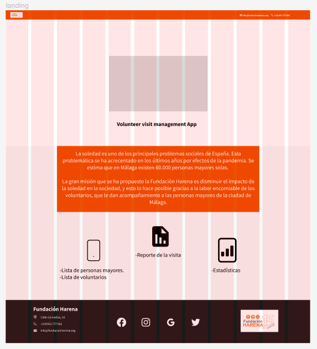

# AngularHarenaProject

Este repositorio muestra la landing page de la app <a href="https://github.com/AnderDeAbrisqueta/HarenaProjectApp">HarenaProjectApp</a> que se desarrollo como requisito del proyecto final del FP de desarrollo de aplicaciones multiplataforma.

## Mock up

El mock up fue realizado en figma:

 

# Landing page

La landing se ha realizado con el framework Angular. Se han usado tres componentes principales: Header, Body y Footer. El header contiene el logo de la fundación, el body está conformado por un audio, un video, un texto explicativo y tres iconos que muestran las características de la aplicación. Uno de ellos lleva a una página hecha en python. Finalmente, el footer contiene la información de la fundación, las redes sociales y un logo. Los otros dos tienen unos modales donde se muestran las características de la aplicación.

Esta landing se ha creado a partir de mobile first, resposive y con la metodología BEM.

## Fuente

-SourceSansPro-Regular

## Color

Los cores utilizados fueron: #ED5001, #F7F7F7 y 1A1A1A.

## Elementos varios:

Se ha colocado un audio en la parte superior izquierda del body.

```
<audio controls >
    <source src="assets/sound/R2.mp3" type="audio/mpeg">
</audio>
```

La página de python fue hecha en pyscript:

```
<!DOCTYPE html>
<html lang="en">
  <head>
    <meta charset="UTF-8" />
    <meta http-equiv="X-UA-Compatible" content="IE=edge" />
    <meta name="viewport" content="width=device-width, initial-scale=1.0" />
    <title>pythonProject</title>
    <link rel="stylesheet" href="style.css">
    <link rel="stylesheet" href="https://pyscript.net/alpha/pyscript.css" />
    <script defer src="https://pyscript.net/alpha/pyscript.js"></script>
    <py-env> - matplotlib </py-env>
  </head>
  <body>
    <div class="plot__container">
      <div id="mpl"></div>
    </div>
    <py-script ouput="mpl" id="plot">
import matplotlib.pyplot as plt

data = {'90': 10, '80': 15, '70': 5, '60': 20}
names = list(data.keys())
values = list(data.values())
      
fig, axs = plt.subplots(1, 3, figsize=(9, 3), sharey=True)
axs[0].bar(names, values)
axs[1].scatter(names, values)
axs[2].plot(names, values)
fig.suptitle('Soledad en las personas mayores')
fig
    </py-script>
  </body>
</html>

```


